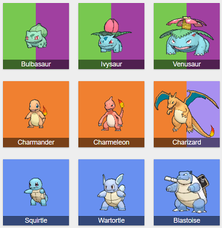
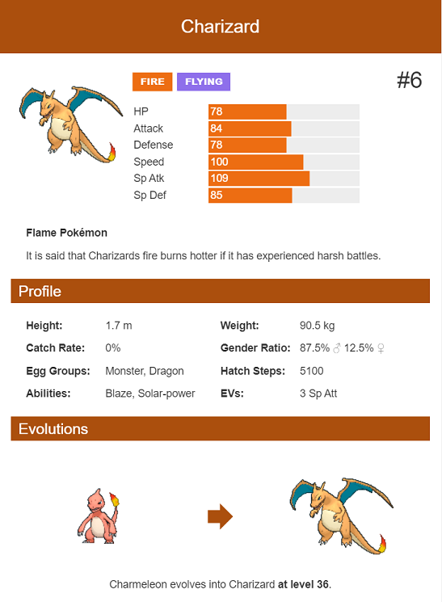

# Projet Pokédex

À l'aide des technologies vues en cours, vous devez réaliser une application web full React permettant de consulter des données de Pokémon en utilisant une API web libre.

L'API à utiliser est la suivante : https://pokeapi.co/docs/v2#pokemon-section

## Technologies à utiliser

- HTML / CSS / JavaScript
- React
- React-Redux
- Axios

## 3 Pages à réaliser 

1. Page de listing de Pokémons
2. Page affichant un Pokémon
3. Page Pokédex

Un menu sous forme de navbar devra également être présent. Il devra également afficher sur la droite le nombre de pokémons dans le Pokédex du visiteur

Chaque page doit contenir en détails :

#### 1. Page de listing

La liste exhaustive des Pokémons de l'API sous forme de cards, avec leur nom et leur photo.

Vous utiliserez un component React réutilisable pour la card.

Exemple :



Chaque card affichant un pokémon doit comporter un bouton d'ajout/suppression au Pokédex du visiteur. Si le pokémon affiché se trouve déjà dans le Pokédex, le bouton devra l'en retirer.

Vous utiliserez un state global (react-redux classique ou redux toolkit au choix) pour stocker la liste du Pokédex.

Cette page doit également comporter un **formulaire permettant de filtrer dynamiquement par nom**.

###### Gérer les photos 

Les photos des pokémons sont répertoriées par ID sur le repository suivant : https://github.com/PokeAPI/sprites/master/sprites/pokemon/

Pour afficher le Pokemon portant l'ID n°6, il suffit de faire un lien vers :

```
https://raw.githubusercontent.com/PokeAPI/sprites/master/sprites/pokemon/6.png
```

> 💡 N'hésitez pas à parcourir le repository, d'autres styles existent :
> - [shiny/6.png](https://raw.githubusercontent.com/PokeAPI/sprites/master/sprites/pokemon/shiny/6.png)
> - [other/dream-world/6.svg](https://raw.githubusercontent.com/PokeAPI/sprites/master/sprites/pokemon/other/dream-world/6.svg)
> - [other/home/6.png](https://raw.githubusercontent.com/PokeAPI/sprites/master/sprites/pokemon/other/home/6.png)
> - [other/official-artwork/6.png](https://raw.githubusercontent.com/PokeAPI/sprites/master/sprites/pokemon/other/official-artwork/6.png)
> - [versions/generation-ii/crystal/6.png](https://raw.githubusercontent.com/PokeAPI/sprites/master/sprites/pokemon/versions/generation-ii/crystal/6.png)
> - [versions/generation-ii/gold/6.png](https://raw.githubusercontent.com/PokeAPI/sprites/master/sprites/pokemon/versions/generation-ii/gold/6.png)
> - [versions/generation-i/yellow/6.png](https://raw.githubusercontent.com/PokeAPI/sprites/master/sprites/pokemon/versions/generation-i/yellow/6.png)
> - [versions/generation-i/red-blue/6.png](https://raw.githubusercontent.com/PokeAPI/sprites/master/sprites/pokemon/versions/generation-i/red-blue/6.png)
> - [versions/generation-ii/silver/6.png](https://raw.githubusercontent.com/PokeAPI/sprites/master/sprites/pokemon/versions/generation-ii/silver/6.png)
> - [versions/generation-iii/emerald/6.png](https://raw.githubusercontent.com/PokeAPI/sprites/master/sprites/pokemon/versions/generation-iii/emerald/6.png)
> - [versions/generation-iii/firered-leafgreen/6.png](https://raw.githubusercontent.com/PokeAPI/sprites/master/sprites/pokemon/versions/generation-iii/firered-leafgreen/6.png)
> - [versions/generation-iii/ruby-sapphire/6.png](https://raw.githubusercontent.com/PokeAPI/sprites/master/sprites/pokemon/versions/generation-iii/ruby-sapphire/6.png)
> - [versions/generation-iv/diamond-pearl/back/6.png](https://raw.githubusercontent.com/PokeAPI/sprites/master/sprites/pokemon/versions/generation-iv/diamond-pearl/back/6.png)
> - [versions/generation-iv/heartgold-soulsilver/6.png](https://raw.githubusercontent.com/PokeAPI/sprites/master/sprites/pokemon/versions/generation-iv/heartgold-soulsilver/6.png)
> - [versions/generation-iv/platinum/6.png](https://raw.githubusercontent.com/PokeAPI/sprites/master/sprites/pokemon/versions/generation-iv/platinum/6.png)
> - [versions/generation-v/black-white/animated/6.gif](https://raw.githubusercontent.com/PokeAPI/sprites/master/sprites/pokemon/versions/generation-v/black-white/animated/6.gif)
> - [versions/generation-v/black-white/6.png](https://raw.githubusercontent.com/PokeAPI/sprites/master/sprites/pokemon/versions/generation-v/black-white/6.png)
> - [versions/generation-vi/omegaruby-alphasapphire/6.png](https://raw.githubusercontent.com/PokeAPI/sprites/master/sprites/pokemon/versions/generation-vi/omegaruby-alphasapphire/6.png)
> - [versions/generation-vi/x-y/6.png](https://raw.githubusercontent.com/PokeAPI/sprites/master/sprites/pokemon/versions/generation-vi/x-y/6.png)
> - [versions/generation-vii/ultra-sun-ultra-moon/6.png](https://raw.githubusercontent.com/PokeAPI/sprites/master/sprites/pokemon/versions/generation-vii/ultra-sun-ultra-moon/6.png)
> - [versions/generation-viii/icons/6.png](https://raw.githubusercontent.com/PokeAPI/sprites/master/sprites/pokemon/versions/generation-viii/icons/6.png)

#### 2. Page Pokémon

Cette page aura une route de la forme `/pokemon/<id>` et devra afficher les détails complets d'un pokémon, avec au minimum les informations suivantes :

- Ses statistiques (HP, Attaque, Defense, Vitesse, …)
- Le/les types auxquel il appartient (feu, terre, eau, …)
- Une description
- Ses caractéristiques (poids, taille, capacités, …)
- Ses évolutions

Par exemple :



Un bouton d'action principal **"Ajouter à mon Pokedex"** devra également être présent sur cette page.

#### 3. Page Pokédex

Cette page liste les Pokémons présents dans le Pokédex personnel du visiteur.

On doit pouvoir retirer un pokémon (avec confirmation) en cliquant sur un bouton.

Ce Pokédex est géré par un state global Redux, et doit se synchroniser avec l'API **Local Storage** du navigateur web.

Vous utiliserez un service `.js` à part pour gérer ce local storage.

## Service API

Vous travaillerez proprement avec un fichier de service `.js` pour gérer l'API Pokémon. Vous ne ferez pas les appels directement dans les composants de vue.

Exemple :

```js
// Pokemon.service.js
import axios from 'axios';

export async function getPokemons() {
    const { data } = await axios.get('https://pokeapi.co/api/v2/pokemon/');
    return data.results;
}

```

Ou en mode "*custom hook*" … :

```js
// Pokemon.service.js

import { useState, useEffect } from 'react';
import axios from 'axios';

export function usePokemons() {
    const [pokemons, setPokemons] = useState([]);

    useEffect(() => {
        async function fetchData() {
            const { data } = await axios.get('https://pokeapi.co/api/v2/pokemon/');
            setPokemons(data.results);
        }
        fetchData();
    }, []); 

    return pokemons;
}
```

… ce qui permet dans un composant d'utiliser directement le hook :

```jsx
import { usePokemons } from './Pokemon.service';

function Home(props) {
    const pokemons = usePokemons();

    // …
}
```

---

## Pour commencer …

Mettre en place l'application avec [ViteJS](https://vitejs.dev/), l'outil nouvelle génération pour la compilation d'application web (semblable à `create-react-app`, mais beaucoup plus rapide).

Tout d'abord, vérifiez que vous avez au moins la version 7 (ou >) de **npm** :

```
npm --version
8.5.5
```

Puis, initialisez l'application React dans un nouveau dossier nommé `pokedex-app` :

```bash
npm create vite@latest pokedex-app -- --template react
```

En suivant les instructions, installez les dépendances et lancez l'application. Vous devriez voir apparaître l'écran suivant :


Supprimez le contenu du composant `App.jsx` ainsi que `App.css`.

Vous travaillerez pour ce projet avec les **[modules CSS](https://create-react-app.dev/docs/adding-a-css-modules-stylesheet/)**.

Si vous le souhaitez, vous pouvez utiliser un pré-processeur CSS comme **Sass** ou **Stylus**, mais ce n'est pas obligatoire.

Votre projet est maintenant prêt à l'emploi pour le développement 👍 !

## Versionning

Vous utiliserez Git comme outil de versionning et produirez des commits réguliers et atomiques (= petits commits pour chaque fonctionnalité), avec des messages conformes.

## Notation

Vous serez noté sur les éléments suivants :

- Qualité de l'intégration HTML/CSS
- Mise en place d'une interface web responsive
- Qualité du code source JavaScript
- Maîtrise de React (props, components, routing, hooks)
- Maîtrise d'un state manager (redux)
- Bonne organisation des fichiers sources (services, components, views, reducers, …)
- Maîtrise de l'outil de versionning Git
- Gestion conforme des exceptions (try/catch)
- Qualité visuelle du rendu final :
    - Interface claire et cohérente
    - Couleurs homogènes
    - Animations/transitions fluides
    - Réactivité aux intéractions (pas ou peu de latences)
    - Affichage de loaders en cas de recherche réseau

**Bonus** :

Les critères bonus pourront réhausser votre appréciation globale :

- Mise en place d'un service worker pour conserver les données offline
- Possibilité d'installer l'application sur le device (desktop ou mobile) en mode PWA

# Rendu

Le rendu se fait sous forme de dépôt sur un repository Github.

Le formateur en charge de la correction doit pouvoir cloner votre projet et le lancer en faisant simplement un `npm install` et un `npm run dev`.

**Une erreur de compilation au démarrage entraînera la note de 0 ! Merci de faire un test sur un dossier vierge avant de remettre votre travail !**